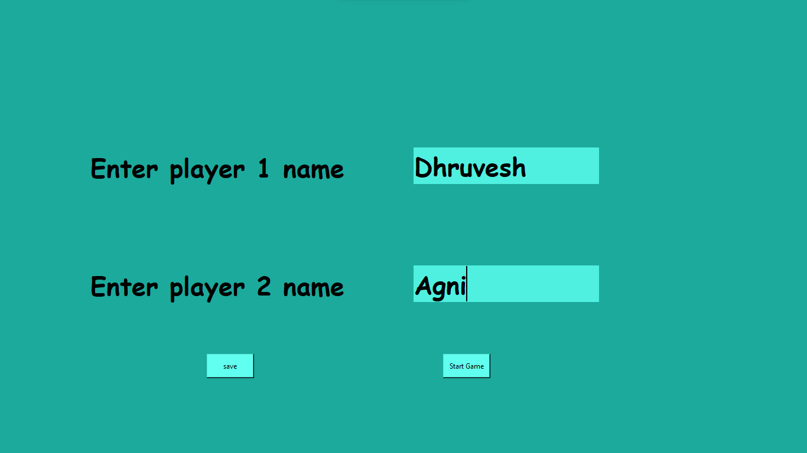
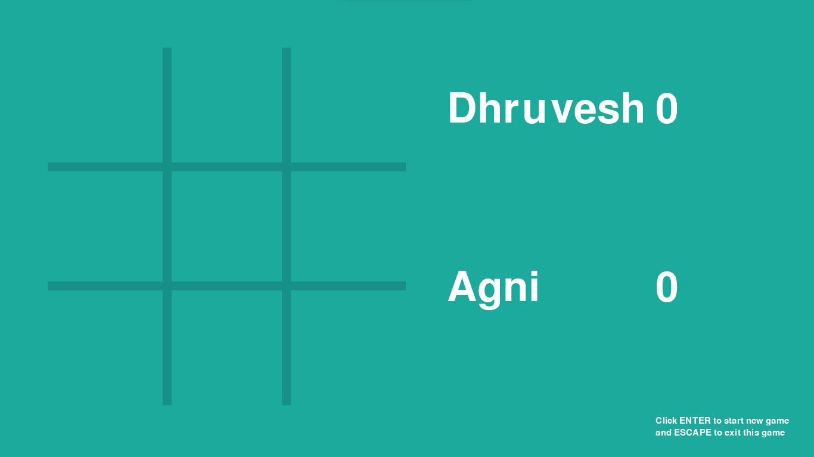
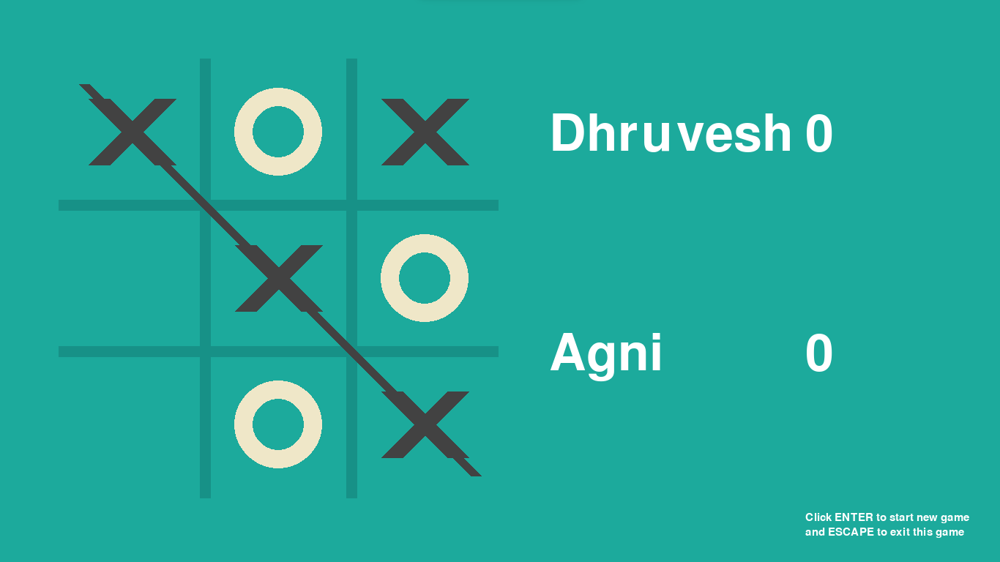

# Tic Tac Toe

# **Intro**
The purpose of creating this project was to understand the concept of loops, condition and functions and implement them in proper way. 

Also, to understand the use of pygame and tkinter libraries. 

This application is built to run on both windows and ios only if you have python install.

# **Requirenment**

As I said earlier you can run this application on windows and ios only if you have [python](https://www.python.org/) install (latest version i.e., version - 3.10.0).

You also need to install [pygame]() and [tkinter]()

### **How to add pygame in your project**

Step 1 : Open your project and type this command in your terminal `pip install pygame` .

### **How to install tkinter**

Step 1 : Open your project and type this command in your terminal `pip install tk` .

Below you can find the screenshot of this application

